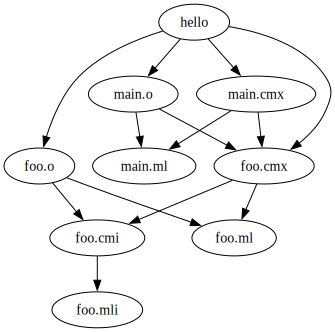

+++
title = "Introducing Alice"
date = 2025-09-07
slug = "introducing-alice"

[taxonomies]
tags = ["tutorial"]
+++

[Alice](https://github.com/alicecaml/alice) is an experimental OCaml build
system and package manager. I'm starting this blog to document progress on its
development. Here's a quick tour of Alice's features at the time of writing.

## Installing OCaml tools

One point of difference between OCaml's packaging ecosystem and that of most other
languages is that the OCaml compiler itself is considered to be a package. This
avoids the need for language version management tools like
[rustup](https://rustup.rs/), [nvm](https://github.com/nvm-sh/nvm), and
[rvm](https://rvm.io/), and it allows projects to declare a minimum or maximum
version of the compiler which they support. However installing the OCaml
compiler as a package means building it from source and this can take a long
time. For various technical reasons, using Opam means recompiling the OCaml
compiler at least once for each new project that you work on which, given the
time it takes to compile, is not ideal.

Since you obviously need a compiler before you can compile any code, it's
probably the first thing that a new user of the OCaml ecosystem will try to do, so I
would like for it to be fast. When I eventually add package management to Alice
I'll develop a packaging ecosystem where the OCaml compiler is _not_ a package.
This is one of the big differences between the packaging philosophies of
Opam and Alice.

Since the compiler is not a package, it's up to the user to make sure it's installed
before compiling any code. To help with this, Alice can act like a language
version manager. I've pre-compiled a relocatable version of the OCaml compiler,
and Alice can install it automatically:
```
$ alice tools get
  Fetching ocaml.5.3.1+relocatable...
 Unpacking ocaml.5.3.1+relocatable...

Successfully installed ocaml.5.3.1+relocatable!

  Fetching ocamllsp.1.22.0...
 Unpacking ocamllsp.1.22.0...

Successfully installed ocamllsp.1.22.0!

  Fetching ocamlformat.0.27.0...
 Unpacking ocamlformat.0.27.0...

Successfully installed ocamlformat.0.27.0!
```

Where did it put the tools?

```
$ ls ~/.alice/ -l
lrwxrwxrwx - s  7 Jul 14:57 current -> /home/s/.alice/roots/5.3.1
drwxr-xr-x - s  7 Sep 18:37 roots

$ ls ~/.alice/roots/5.3.1
bin  doc  lib  man  share

$ ls ~/.alice/roots/5.3.1/bin
ocaml          ocamldoc.opt       ocamlobjinfo.opt  ocamlrund-0096
ocamlc         ocamlformat        ocamlopt          ocamlruni
ocamlc.byte    ocamlformat-rpc    ocamlopt.byte     ocamlruni-00d6
ocamlc.opt     ocamllex           ocamlopt.opt      ocamlruni-0096
ocamlcmt       ocamllex.byte      ocamloptp         ocamlyacc
ocamlcp        ocamllex.opt       ocamlprof         x86_64-pc-linux-musl-ocamlrun-0096
ocamldebug     ocamllsp           ocamlrun          x86_64-pc-linux-musl-ocamlrund-0096
ocamldep       ocamlmklib         ocamlrun-00d6     x86_64-pc-linux-musl-ocamlruni-0096
ocamldep.byte  ocamlmktop         ocamlrun-0096
ocamldep.opt   ocamlobjinfo       ocamlrund
ocamldoc       ocamlobjinfo.byte  ocamlrund-00d6
```

The `~/.alice/current` symlink can be easily changed to a different "root" (what
I'm calling a filesystem containing installations of the compiler and several
tools) with `alice tools change` however currently the only available version is
`5.3.1`.

You'll note that `ocamllsp` and `ocamlformat` are also installed. This pair of
tools is used by most OCaml developers so to improve the experience of using
Alice for the first time I've pre-compiled binary versions of these packages
too. The `ocamllsp` tool needs to be compiled with the same compiler as the code
it's analyzing. When I built the `ocamllsp` binary package installed by Alice I
used the same compiler as the one that Alice installs, so it's guaranteed that
the copy of `ocamllsp` will be compatible with the compiler if you install both
through Alice.

When Alice runs the compiler it just looks it up in the `PATH` variable, so you
can still install a different version of the complier (e.g. with Opam) and have
Alice run that for you. If no OCaml compiler is found in `PATH` then Alice will
fall back to running the one from `~/.alice/current/bin`. If you want to guarantee
that Alice's OCaml compiler will be run by Alice, add `~/.alice/current/bin` to
the beginning of your `PATH` variable.

## Hello, World!

Alice can set up a new project containing an executable or library package:
```
$ alice new --help
Create a new alice project.

Usage: alice new [OPTION]… <NAME>

Arguments:
  <NAME>  Name of the project

Options:
  -v, --verbose      Enable verbose output (-vv for extra verbosity).
  -q, --quiet        Supress printing of progress messages.
  -p, --path <FILE>  Initialize the new project in this directory (must not already exist)
      --exe          Create a project containing an executable package (default)
      --lib          Create a project containing a library package
  -h, --help         Show this help message.
```

Let's make a new executable package:
```
$ alice new hello
  Creating new executable package "hello" in /tmp/alicedemo/hello

$ cd hello
```

Take a look at the project:
```
$ tree
.
├── Alice.toml
└── src
    └── main.ml

2 directories, 2 files

$ cat Alice.toml
[package]
name = "hello"
version = "0.1.0"

$ cat src/main.ml
let () = print_endline "Hello, World!"
```

Alice has a command `alice run` that builds and runs the current package if it's
an executable package:
```
$ alice run
 Compiling hello v0.1.0
   Running /tmp/alicedemo/hello/build/hello

Hello, World!
```

What did that build?

```
$ ls build/
hello  main.cmi  main.cmx  main.ml  main.o
```

The `build` directory was generated when building the project and contains all
built artifacts. To remove it, run:
```
$ alice clean
```

## Multi-file projects

Add a new file `src/foo.ml` with contents:
```ocaml
let message = "Hello, Alice!"
```

And make an interface file `src/foo.mli` with contents:
```ocaml
val message : string
```

Finally modify `src/main.ml` so that it contains:
```ocaml
let () = print_endline Foo.message
```

Now run `alice run` again.

```
 Compiling hello v0.1.0
   Running /tmp/alicedemo/hello/build/hello

Hello, Alice!
```

## Incremental Compilation

To build a project without running it we can run `alice build`:
```
$ alice build --help
Build a project.

Usage: alice build [OPTION]…

Options:
  -v, --verbose               Enable verbose output (-vv for extra verbosity).
  -q, --quiet                 Supress printing of progress messages.
      --manifest-path <FILE>  Read project metadata from this file instead of Alice.toml.
      --release               Build with optimizations.
  -h, --help                  Show this help message.
```

Let's turn up the verbosity to see what's happening under the hood. Clean the
project and then run `alice build -vv`:
```
$ alice clean
$ alice build -vv
 Compiling hello v0.1.0
[DEBUG] Running command: /home/s/.alice/current/bin/ocamldep.opt -one-line -native foo.mli
[DEBUG] Running command: /home/s/.alice/current/bin/ocamldep.opt -one-line -native foo.ml
[DEBUG] Running command: /home/s/.alice/current/bin/ocamldep.opt -one-line -native main.ml
 [INFO] Copying source file: foo.mli
 [INFO] Building targets foo.cmi
[DEBUG] Running command: /home/s/.alice/current/bin/ocamlopt.opt -g -c foo.mli
 [INFO] Copying source file: foo.ml
 [INFO] Building targets foo.cmx, foo.o
[DEBUG] Running command: /home/s/.alice/current/bin/ocamlopt.opt -g -c foo.ml
 [INFO] Copying source file: main.ml
 [INFO] Building targets main.cmx, main.o
[DEBUG] Running command: /home/s/.alice/current/bin/ocamlopt.opt -g -c main.ml
 [INFO] Building targets hello
[DEBUG] Running command: /home/s/.alice/current/bin/ocamlopt.opt -g -o hello foo.cmx main.cmx
```

Running `alice build -vv` a second time shows that most of the work is now
skipped.

```
$ alice build -vv
 Compiling hello v0.1.0
[DEBUG] Running command: /home/s/.alice/current/bin/ocamldep.opt -one-line -native foo.mli
[DEBUG] Running command: /home/s/.alice/current/bin/ocamldep.opt -one-line -native foo.ml
[DEBUG] Running command: /home/s/.alice/current/bin/ocamldep.opt -one-line -native main.ml
```

The project is already built so there's nothing to do the second time around.
Those calls of `ocamldep.opt` can probably be skipped to with some extra work!

Now change `src/main.ml` without changing any other source files.
```ocaml
let () = print_endline (String.cat Foo.message "Yay!")
```

Rebuilding yet again:
```
$ alice build -vv
 Compiling hello v0.1.0
[DEBUG] Running command: /home/s/.alice/current/bin/ocamldep.opt -one-line -native foo.mli
[DEBUG] Running command: /home/s/.alice/current/bin/ocamldep.opt -one-line -native foo.ml
[DEBUG] Running command: /home/s/.alice/current/bin/ocamldep.opt -one-line -native main.ml
 [INFO] Copying source file: main.ml
 [INFO] Building targets main.cmx, main.o
[DEBUG] Running command: /home/s/.alice/current/bin/ocamlopt.opt -g -c main.ml
 [INFO] Building targets hello
[DEBUG] Running command: /home/s/.alice/current/bin/ocamlopt.opt -g -o hello foo.cmx main.cmx
```

It rebuilt some of the artifacts but not all of the artifacts (e.g. it did not
rebuild `foo.cmx` or `foo.o`) since those would be unchanged. Alice knows that
if `src/foo.ml` did not change since the last time `foo.cmx` was generated,
there is no need to generate `foo.cmx` again.

## Dependency Graphs

Build targets depend on source files, and possibly on other build targets. Alice
needs to know which targets depend on which other files/targets. To help users
understand their projects' build dependencies and to help me debug issues with
Alice, there is a command `alice dot` which generates a Graphviz dot file
containing the project's build graph.

```
$ alice dot
digraph {
  "foo.cmi" -> {"foo.mli"}
  "foo.cmx" -> {"foo.cmi", "foo.ml"}
  "foo.o" -> {"foo.cmi", "foo.ml"}
  "hello" -> {"foo.cmx", "foo.o", "main.cmx", "main.o"}
  "main.cmx" -> {"foo.cmx", "main.ml"}
  "main.o" -> {"foo.cmx", "main.ml"}
}
```

We can use Graphviz to visualize this:
```
$ alice dot | dot -Tsvg > graph.svg
```



## What's next?

My most recent big push on Alice was
[getting it running on Windows](https://www.gridbugs.org/porting-my-toy-ocaml-build-system-to-windows/).
My next focus will be allowing packages to depend on each other, which will be
the first step on the long journey to supporting package management -
one of my long-term goals for this project. The first big milestone along that
path will be bootstrapping, where Alice has enough build-system and
package-management features to _build itself_, and all of its dependencies have
been ported to Alice's nascent package ecosystem.
