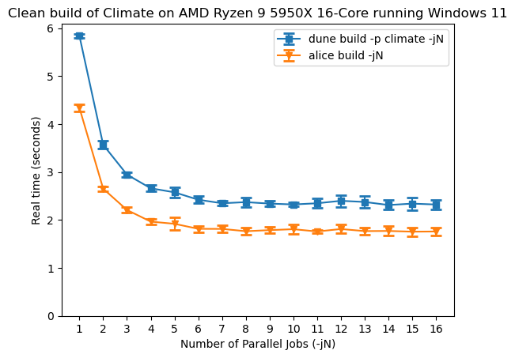

+++
title = "Parallel Alice without Eio"
date = 2026-02-25
slug = "parallel-alice-without-eio"
description = "Parallel builds in the Alice OCaml build system without Eio"

[taxonomies]
tags = ["implementation"]

[extra]
og_image = "ryzen-windows.png"
+++

In my [previous post](@/blog/parallel-alice/index.md) I wrote about adding
support for parallel builds to Alice using concurrency primitives from the
[Eio](https://github.com/ocaml-multicore/eio) library.
Eio doesn't support spawning processes on Windows, and depending on Eio meant
that I could no longer build Alice on Windows using Dune package management,
which complicated development and CI workflows.
It's important to me that Windows users aren't treated as second-class citizens,
so I've dropped Eio as a dependency and implemented some parallel subprocess
management logic directly in Alice.

As described in my previous post there are two places in Alice where it runs a
lot of external processes: computing inter-file dependencies with `ocamldep` and
compiling OCaml code with `ocamlopt`.

Computing dependencies is embarrassingly parallel. The `ocamldep` program needs
to be run on each source file in the project, and the order doesn't matter.
We need to make sure the number of simultaneously running processes doesn't
exceed the maximum number of jobs (the argument to `-j`), and the standard
output of each process needs to be collected and parsed so Alice can find out
inter-file dependencies. The strategy will be to start as many processes as is
permitted by the maximum number of jobs, and then whenever a process completes,
start a new process in its place.

To check if a process has completed, the standard library has a function:
```ocaml
val waitpid : wait_flag list -> int -> int * process_status
```
Passing `WNOHANG` in the list of `wait_flag`s causes the function to return
immediately with a (non-existent) pid of 0 if the process is still running.
Alice needs to monitor the status of multiple concurrent processes so it can't
block until any specific process completes. It spins in a loop, continuously
checking the status of all running processes, with a short pause in between each
iteration via `Unix.sleepf` so your computer doesn't get too hot.

Actively polling the status of each running process in a loop feels a bit
inefficient, and the standard library does provide an alternative way to wait
until any child process completes:
```ocaml
  val wait : unit -> int * process_status
  (** Wait until one of the children processes die, and return its pid
     and termination status.

     @raise Invalid_argument on Windows. Use {!waitpid} instead. *)
```

But unfortunately it's not available on Windows, so actively polling will have
to do.

To parallelize computing dependencies I implemented the above strategy for
scheduling processes, and refactored the logic around it to compute all
dependencies as a single batch. This is less ergonomic than using Eio since I
can no longer write straight-line code and mostly pretend it's synchronous.

Next I parallelized compiling OCaml code. This was more complicated because
invocations of the compiler are constrained by a partial order, with some
commands needing to have completed before others can start. Alice
computes a DAG representing the build plan which exactly captures these
relationships between commands already, and this DAG can be used to schedule
processes in a correct order.

The strategy will be similar to computing dependencies, except we need to be
careful to only start processes when they're ready. Each node in the DAG
represents a command for which a process will be spawned. Initially just the
leaves of the DAG (the nodes with no children) can be started. When a process
completes, check each of its parents to see if any of them are now ready to
start. Add all the ready parents to a "ready" queue, and start as many processes
from this queue as are allowed by the user-specified maximum number of jobs.

The main difficulty was due to technical debt. My DAG implementation didn't have
a way to access tho parents of a node, and initially each node in the build plan
represented a file to be built rather than a command. Nodes knew
the command that would create their file, but since commands can generate
multiple files, commands were effectively duplicated between multiple nodes (all
the nodes whose files the command would create). When scheduling processes it's
much easier to think of nodes as commands, and not duplicate commands, so it was
DAG-refactoring o'clock which meant updating the logic for generating build
plans and dependency graphs which share the same underlying DAG representation
despite being unrelated to the work I set out to do parallelizing Alice.

Now that parallel Alice works on Windows I can add an additional set of
benchmarks to the [comparison with
Dune](@/blog/parallel-alice/index.md#benchmarks) from my previous post.


