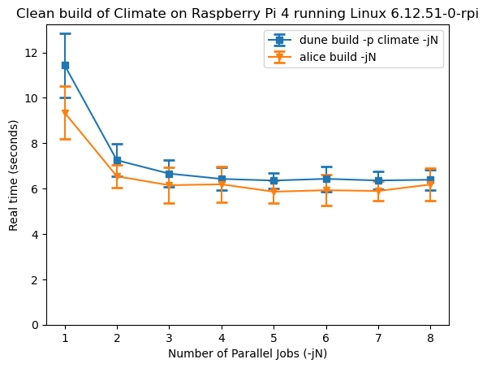
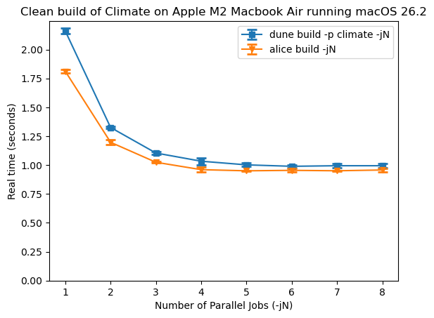
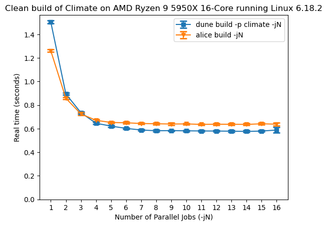

+++
title = "Parallel Alice"
date = 2026-02-01
slug = "parallel-alice"

[taxonomies]
tags = ["implementation"]

[extra]
og_image = "parallel-alice.png"
+++


The next release of Alice will support parallel builds.

Alice runs external commands to build OCaml projects.
While computing the build plan it runs the OCaml compiler to
determine dependencies between object files, and then of course
while executing the build plan it runs the compiler to compile OCaml code.
Many invocations of the compiler are independent from one another
presenting an opportunity to do them in parallel.

I used the library [eio](https://github.com/ocaml-multicore/eio) which contains
effects-based IO and concurrency primitives. All the concurrent OCaml I've written
until now used a concurrency monad (e.g. [lwt](https://github.com/ocsigen/lwt)),
but doing so requires threading monadic control flow throughout the code.
A useful property of effects is that any function can "perform" an effect without
changing its type signature, as long as an appropriate effect handler is installed.
You can write straight-line synchronous-looking code, but when it does IO, instead of
blocking the thread, it performs (raises sort of) an effect to the effect handler.
In the case of eio, the handler runs the IO operation asynchronously and schedules
other OCaml code or IO to run at the same time. When the IO completes, the original
function is resumed with the result of the IO.

Here's an example. This is the signature for the `Eio.Fiber.pair` functions which runs
a pair of "fibers" concurrently, returning both of their results. In eio a fiber is
just a function that may perform effects which are handled by eio's effect handler.
```ocaml
val pair : (unit -> 'a) -> (unit -> 'b) -> 'a * 'b
```

Contrast this with lwt, which uses monadic concurrency. Here's the signature of `Lwt.both`:
```ocaml
val both : 'a t -> 'b t -> ('a * 'b) t
```
Here the type constructor `'a t` is a promise that resolves to a value of type `'a`.
In code written with monadic concurrency it's common for most functions to return
a `_ t`, since if one function calls a second function that returns a `_ t`, the only
way to make the types work out will often be for that first function to also return a `_ t`,
and thus the type constructor spreads throughout the code.

The strategy for introducing parallel builds into Alice will be to use eio to run external
commands in parallel, but continue using a single OCaml thread (technically a single _domain_).
There are two different points in the build process where parallelism will be introduced:
 - running `ocamldep` to determine dependencies between object files
 - running the compiler to compile the code

## Determining Dependencies between Object Files

An OCaml source file can only be compiled into an object file if all the modules
it refers to have already been compiled. There's a partial order on the source files
of a project that requires certain files be built before certain other files.
The OCaml toolchain contains a tool `ocamldep` which prints the dependencies of a given
source file, and Alice runs this program for each source file in the project to construct
the build plan.

This step is trivial to parallelise since `ocamldep` can be run on files in any
order without affecting the results.

The first step was wrapping the build process in a call to `Eio_main.run` which installs
an effect handler. To spawn processes with eio we need a "process manager" which is part
of the eio environment.

```ocaml
  Eio_main.run (fun env ->
    let proc_mgr = Eio.Stdenv.process_mgr env in
    (* ... build the project *)
  )
```

Next I changed the logic for running `ocamldep` from calling `Unix.create_process`
to `Eio.Process.parse_out`. There's a function in Alice called `Ocamldep_cache.get_deps`
which tries to load a cached `ocamldep` result for a given file, and runs `ocamldep`
if it's not found in the cache. This function is just called in a loop over every source
file in the project, and in eio concurrency parlance we can now think of this function as
a fiber which can be run concurrently with other fibers.

So now just run all the fibers concurrently and collect their results using a helper function
from `Eio.Fiber`. There's `Eio.Fiber.all`:
```ocaml
val all : (unit -> unit) list -> unit
```
But that won't work because my fibers compute results.
Unless I missed something there's no built-in way to run a list of fibers and return
a list of their results.
I could have used `Eio.Fiber.all` to run a fiber that populates a `ref` cell with the output
of `ocamldep` for each source file but that seemed messy. Instead in the end I implemented my own
`all_values` function based on `Eio.Fiber.pair`.

```ocaml
let rec all_values fs =
  match fs with
  | [] -> []
  | [ x ] -> [ x () ]
  | [ a; b ] ->
    let a, b = Eio.Fiber.pair a b in
    [ a; b ]
  | x :: xs ->
    let x, xs = Eio.Fiber.pair x (fun () -> all_values xs) in
    x :: xs
```

I'm really curious if I missed something or if there's a reason for not using fibers like this.

## Compiling OCaml Code

Alice has some logic for scheduling calls to the compiler so that files are compiled
in an order that satisfies the dependencies between files as determined by `ocamldep`.
When parallelizing calls to the compiler we need to make sure that they still satisfy
the dependencies. My strategy is to think of each call to the compiler as a fiber, and have
each fiber keep track of the other fibers that must complete before it can start.
Concretely, use a condition variable per file, and when a call to the compiler completes it
broadcasts on the condition variables of each file it just created. Before any given call
to the compiler, first wait on the condition variable of each file that must exist before
that particular call to the compiler.

Alice's logic for evaluating build plans originally interspersed running the
compiler with traversing the build plan. To parallelize calls to the compiler, I changed it
to produce a list of fibers with the above logic for waiting and broadcasting on
per-file condition variables. Finally I just ran all the fibers concurrently with `Eio.Fiber.all`
(this time my fibers don't return a value).

## Limited Parallelism with `-j`

When `-j <number>` is passed to `alice build` and friends, Alice uses a global semaphore
to limit the number of parallel calls to the compiler.

## Windows Complications

Alice uses Dune's package management features to manage its dependencies for local
development and when running tests in CI. It's a little known fact that Dune package
management mostly works on Windows as long as your entire dependency closure builds with Dune
and you use `ocaml-system` as your compiler. Alice ticked all these boxes so developing
it on Windows was possible with Dune package management. Unfortunately, eio depends on
some packages that don't build with Dune.

Initially I tried to work around the problem by manually modifying the
lockfiles using some
[tricks](https://github.com/alicecaml/alice-tool-build-scripts/blob/38f0221c8023425c15b747a1e20fff207144b8ff/5.3.1/windows-notes.md)
I learnt while getting Alice's dev tools working on Windows.
This actually worked fine for local development, but I started running into issues in CI
that I couldn't reproduce locally, and it took 15 minutes to run CI so the try/fail loop
would be painfully long.

```
File "dune.lock/topkg.1.1.1.pkg", line 7, characters 5-7:
7 |      sh
         ^^
Error: Logs for package topkg
ocamlfind: Package `threads' not found
Warning: WARNING] OCaml host-os conf:  cmd ["ocamlfind" "ocamlc" "-config"]: exited with 2
Warning: WARNING] OCaml host-os conf: key native: undefined, stdlib dir not found for discovery
                  using false
Warning: WARNING] OCaml host-os conf: key natdynlink: undefined, stdlib dir not found for discovery
                  using false
Warning: WARNING] OCaml host-os conf: key supports_shared_libraries: undefined, stdlib dir not found for discovery
                  using false
Warning: WARNING] OCaml host-os conf: key ext_obj: undefined, using ".o"
Warning: WARNING] OCaml host-os conf: key ext_lib: undefined, using ".a"
Warning: WARNING] OCaml host-os conf: key ext_dll: undefined, using ".so"
Warning: WARNING] OCaml host-os conf: key ext_exe: undefined and
                  no C toolchain detected, using ""
ocamlfind: Package `threads' not found
ocamlfind: Package `threads' not found
Error: : The library directory where ocamlbuild was originally installed (D:\a\alice\alice\_build/.sandbox/1e137b948d479f5e3d8239d05c7f7865/_private/default/.pkg/ocamlbuild/target/lib\ocamlbuild) either no longer exists, or does not contain a copy of the ocamlbuild library. Guessing that the correct library directory is D:\a\alice\alice\_build\_private\default\.pkg\ocamlbuild\target\lib\ocamlbuild because a copy of the ocamlbuild library exists at that location, and because it is located at the expected path relative to the current ocamlbuild executable. This can happen if ocamlbuild's files are moved from the location where they were originally installed.pkg.ml: [ERROR] cmd ["ocamlbuild" "-use-ocamlfind" "-classic-display" "-j" "4" "-tag" "debug"
     "-build-dir" "_build" "pkg.otarget"]: exited with 2

Error: Process completed with exit code 1.
```

Getting to this point required manual changes to lockdirs, forking and patching
both `ocamlfind` and `dune` itself. So I admitted defeat and concede that Dune
package management doesn't work on Windows yet, and switched to opam for local
development of Alice and CI on Windows which mostly works, except that now when
I run tests I get this error:
```
Fatal error: exception Failure("process operations not supported on Windows yet")
```

This is an error from eio stating that support for managing processes isn't
implemented on Windows.
So for now Alice on Windows doesn't support parallel builds and falls back to
blocking process management. I might revisit this in the future or experiment
with using lwt instead.

## Benchmarks

For these experiments I built the library [climate](https://github.com/gridbugs/climate)
with both Alice and Dune with different levels of parallelism by passing different values
to the `-j` argument of their respective build commands. The comparison isn't a perfectly
apples-to-apples comparison since I couldn't figure out how to prevent Dune from
building bytecode object files (in addition to native object files) whereas Alice only
compiles code natively. The comparison is to show that Alice and Dune are in the same
ballpark, not that one tool meaningfully outperforms the other.

Each benchmark was performed 32 times, and the means are plotted with
the standard deviation indicated with error bars.

To build the package with Dune I used the command `dune build -p climate` rather than simply
`dune build` as the former was consistently faster.





## Next Steps

This post covered parallelising the builds of individual files within a single
Alice package, but I'm yet to allow building multiple packages in parallel.
There's also more IO which Alice performs, mostly related to generating and copying
files, which could possibly be parallelised.


